# 🚀 GitHub Actions CI/CD Learning Project

A hands-on project to learn **GitHub Actions** by building a complete CI/CD pipeline for a Dockerized Flask application.

## 📚 What You'll Learn

- ✅ GitHub Actions workflow syntax and structure
- ✅ Automated testing with pytest
- ✅ Docker image building and publishing
- ✅ CI/CD pipeline concepts
- ✅ Secrets management in GitHub
- ✅ Job dependencies and workflow optimization

## 🏗️ Project Structure

```
DockerImage/
├── .github/
│   └── workflows/
│       └── cicd.yml          # GitHub Actions workflow definition
├── app.py                    # Flask web application
├── test_app.py              # Automated tests
├── Dockerfile               # Docker containerization config
├── requirements.txt         # Python dependencies
└── README.md               # This file
```

## 🔄 CI/CD Pipeline Overview

The workflow automatically runs when you push code to the `main` branch:

```mermaid
graph LR
    A[Push to GitHub] --> B[Job 1: Docker Build Test]
    B --> C[Job 2: Run Tests]
    C --> D{Tests Pass?}
    D -->|Yes| E[Job 3: Build & Push to Docker Hub]
    D -->|No| F[Stop Pipeline]
    E --> G[✅ Image Published]
```



### Pipeline Jobs

1. **dockerbuild**: Quick sanity check - verifies Docker image builds
2. **build-and-test**: Installs dependencies and runs pytest tests
3. **build-and-publish**: Builds final image and pushes to Docker Hub (only if tests pass)

## 🛠️ Setup Instructions

### Prerequisites

1. **GitHub Account** - [Sign up here](https://github.com/join)
2. **Docker Hub Account** - [Sign up here](https://hub.docker.com/signup)
3. **Git** installed locally
4. **Docker** installed (optional, for local testing)

### Step 1: Create Docker Hub Access Token

1. Go to [Docker Hub](https://hub.docker.com)
2. Click your profile → **Account Settings** → **Security**
3. Click **New Access Token**
4. Name it `github-actions` and click **Generate**
5. **Copy the token** (you won't see it again!)

### Step 2: Create GitHub Repository

```bash
# Initialize git repository
cd /home/lenovo/DockerImage
git init
git add .
git commit -m "Initial commit: Flask app with GitHub Actions CI/CD"

# Create repository on GitHub (via web interface)
# Then connect your local repo:
git remote add origin https://github.com/YOUR_USERNAME/YOUR_REPO_NAME.git
git branch -M main
git push -u origin main
```

### Step 3: Configure GitHub Secrets

1. Go to your GitHub repository
2. Click **Settings** → **Secrets and variables** → **Actions**
3. Click **New repository secret**
4. Add these two secrets:

| Name | Value |
|------|-------|
| `DOCKER_USERNAME` | Your Docker Hub username |
| `DOCKER_PASSWORD` | The access token you created in Step 1 |

### Step 4: Trigger the Workflow

```bash
# Make any change to trigger the workflow
echo "# Testing CI/CD" >> README.md
git add .
git commit -m "Test GitHub Actions workflow"
git push
```

### Step 5: Monitor the Workflow

1. Go to your GitHub repository
2. Click the **Actions** tab
3. Watch your workflow run in real-time!
4. Check Docker Hub to see your published image

## 🧪 Local Testing

### Test the Flask App

```bash
# Install dependencies
pip install -r requirements.txt

# Run the app
python app.py

# Visit http://localhost:5000 in your browser
```

### Run Tests

```bash
# Run pytest
pytest

# Run with verbose output
pytest -v
```

### Build Docker Image Locally

```bash
# Build the image
docker build -t flask-test .

# Run the container
docker run -p 5000:5000 flask-test

# Visit http://localhost:5000
```

## 📖 Understanding the Workflow

### Workflow File Location

`.github/workflows/cicd.yml` - GitHub automatically detects and runs workflows in this directory

### Key Concepts

#### 1. **Triggers** (`on:`)
```yaml
on:
  push:
    branches: [ main ]  # Run on push to main
  pull_request:
    branches: [ main ]  # Run on PRs to main
```

#### 2. **Jobs** (`jobs:`)
Each job runs in a fresh virtual machine:
```yaml
jobs:
  build-and-test:
    runs-on: ubuntu-latest  # Use Ubuntu VM
```

#### 3. **Steps**
Individual tasks within a job:
```yaml
steps:
  - uses: actions/checkout@v3  # Use pre-built action
  - name: Run tests
    run: pytest  # Run shell command
```

#### 4. **Job Dependencies**
```yaml
build-and-publish:
  needs: build-and-test  # Only run if build-and-test succeeds
```

#### 5. **Secrets**
Secure way to store credentials:
```yaml
username: ${{ secrets.DOCKER_USERNAME }}
```

## 🎯 Common Workflow Patterns

### Conditional Execution
```yaml
- name: Deploy
  if: github.ref == 'refs/heads/main'  # Only on main branch
  run: ./deploy.sh
```

### Matrix Builds
```yaml
strategy:
  matrix:
    python-version: [3.8, 3.9, 3.10]  # Test multiple versions
```

### Caching Dependencies
```yaml
- uses: actions/cache@v3
  with:
    path: ~/.cache/pip
    key: ${{ runner.os }}-pip-${{ hashFiles('requirements.txt') }}
```

## 🐛 Troubleshooting

### Workflow Not Running?
- Check that the workflow file is in `.github/workflows/`
- Ensure you pushed to the `main` branch
- Check the Actions tab for error messages

### Docker Push Failing?
- Verify secrets are set correctly in GitHub
- Ensure Docker Hub access token has write permissions
- Check that the repository name matches your Docker Hub username

### Tests Failing?
- Run `pytest` locally to see detailed error messages
- Check that all dependencies are in `requirements.txt`
- Ensure test assertions match expected behavior

## 🚀 Next Steps

Once you've mastered this project, try:

1. **Add more tests** - Increase code coverage
2. **Deploy to cloud** - Add deployment to AWS, GCP, or Azure
3. **Add linting** - Include code quality checks (flake8, black)
4. **Multi-stage builds** - Optimize Docker image size
5. **Environment-specific deployments** - Deploy to staging/production
6. **Notifications** - Send Slack/email notifications on success/failure

## 📚 Additional Resources

- [GitHub Actions Documentation](https://docs.github.com/en/actions)
- [Docker Documentation](https://docs.docker.com/)
- [Flask Documentation](https://flask.palletsprojects.com/)
- [pytest Documentation](https://docs.pytest.org/)

## 🤝 Contributing

This is a learning project! Feel free to:
- Add new features
- Improve the workflow
- Add more comprehensive tests
- Enhance documentation

## 📝 License

This project is open source and available for learning purposes.

---

**Happy Learning! 🎉**

If you found this helpful, give it a ⭐ on GitHub!# Testing CI/CD
# Testing CI/CD1
